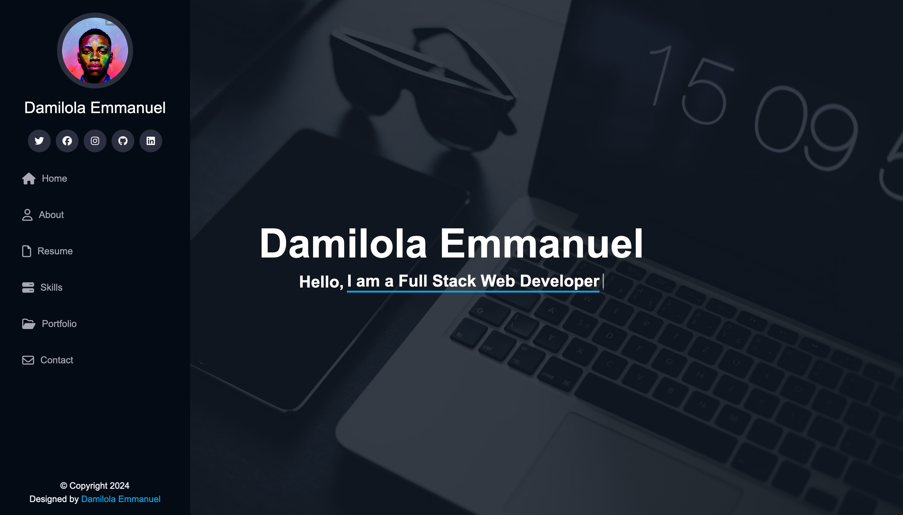

# Portfolio Website

This is a personal portfolio website showcasing my skills, projects, and experience as a Full Stack Web Developer.



## Features

- **Responsive Design**: The website is fully responsive and works well on all devices.
- **Smooth Scrolling**: Smooth scrolling when navigating to different sections.
- **Typing Effect**: A typing effect for the introduction text.
- **Interactive Animations**: Skill cards and project cards with animations.
- **Contact Form**: A contact form that sends messages to an email address and displays a success popup.

## Technologies Used

- **Frontend**:
  - HTML
  - CSS
  - JavaScript

- **Backend** (for handling contact form submissions):
  - Node.js with Express 

## Setup and Installation

### Prerequisites

- Node.js and npm installed on your system.

### Installation

1. Clone the repository:

   ```bash
   git clonehttps://github.com/Damilordz/personal_portfolio_website.git
   cd personal_portfolio_website
   ```

2. Install the backend dependencies:
   ```
   cd backend
   npm install
   ```
   
3. Set up environment variables for your backend (e.g., email service credentials). Create a  `.env` file in the backend directory and add the necessary variables:
   ```
   EMAIL_USER=your-email@example.com
   EMAIL_PASS=your-email-password
   ```

4. Start the backend server:
   ``` 
   npm start
   ```

5. Open `index.html` in your browser to view the website.
 
 ##Usage

- Navigate to different sections using the navigation links.
- Use the contact form to send a message. Upon successful submission, a popup message will be displayed.

## Contributing

Contributions are what make the open source community such an amazing place to learn, inspire, and create. Any contributions you make are greatly appreciated.